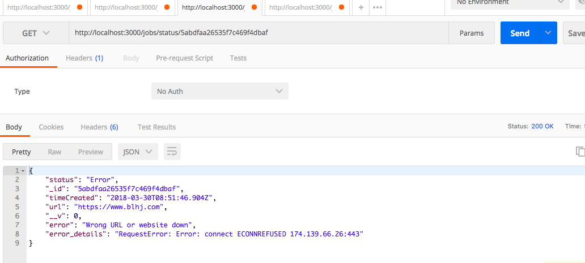

# A worker Job Queue 
Create a job queue whose workers fetch data from a URL and store the results in a database. The job queue should expose a REST API for adding jobs and checking their status / results.

Example:

User submits www.google.com to your endpoint. The user gets back a job id. Your system fetches www.google.com (the result of which would be HTML) and stores the result. The user asks for the status of the job id and if the job is complete, he gets a response that includes the HTML for www.google.com.

## Table of Contents
* [Setup](#setup)
* [Files](#files)
* [Tech Stack](#technologiesused)
* [Testing Framework](#testing)
* [Documentation and Usage](#docs)


## <a name="setup"></a>Setup

* requires mongodb and redis installed prior to running this app
* $ mongod (to run mongo server)
* $ redis-server /usr/local/etc/redis.conf (to run redis server)
* $ git clone this directory 
* $ cd into cloned directory
* $ npm install (this step will install all dependencies from package.json)
* $ node server.js

## <a name="files"></a>Files

* server.js -> Main file where app and its routes are called
* database.js -> Schema Design and connection to MongoDB
* routeFunctions.js -> Get and Post methods defined here
* test/test.js -> TestDB for integration tests and unit tests
* package.json -> Defines all dependencies


## <a name="technologiesused"></a>Tech Stack

* Database : MongoDB, Mongoose ODM
* Server : Node.js, Express.js, bluebird Promises
* Testing : Mocha, Chai and Supertest

## <a name="testing"></a>Testing Framework

* Using Mocha, Supertest, Chai's expect library and Should
* Made file test.js under test folder 
* To run tests - 
    - ./node_modules/mocha/bin/mocha    OR
    - "scripts": {

        "test": "mocha"         
        }

      npm test OR npm run tests  OR mocha


## <a name="docs"></a>Documentation

 I used POSTMAN to verify my GET and POST requests

--------------------------------------------------------------------------------------------------------------------

### POST REQUEST - http://localhost:3000/jobs/url

 This will create a new jobEntry in the database and returns the following response-

 

--------------------------------------------------------------------------------------------------------------------

### GET REQUEST - http://localhost:3000/jobs/status/:jobID

 This will get the status of jobID- 


--------------------------------------------------------------------------------------------------------------------

### If there was an error in fetching url, user gets the following response with detailed error message in the response object itself-


```
     {
        "status": "Error",
        "_id": "5abdfaa26535f7c469f4dbaf",
        "timeCreated": "2018-03-30T08:51:46.904Z",
        "url": "https://www.blhj.com",
        "__v": 0,
        "error": "Wrong URL or website down",
        "error_details": "RequestError: Error: connect ECONNREFUSED 174.139.66.26:443"
    }
```

--------------------------------------------------------------------------------------------------------------------

### If incorrect jobID is provided, user gets the following response-

```
    {
        "error": "No such jobID found"
    }
```

--------------------------------------------------------------------------------------------------------------------

### If the user doesn't provide any 'url' key in post request, following response is generated-

```
    You must enter 'url' as key

```

--------------------------------------------------------------------------------------------------------------------
