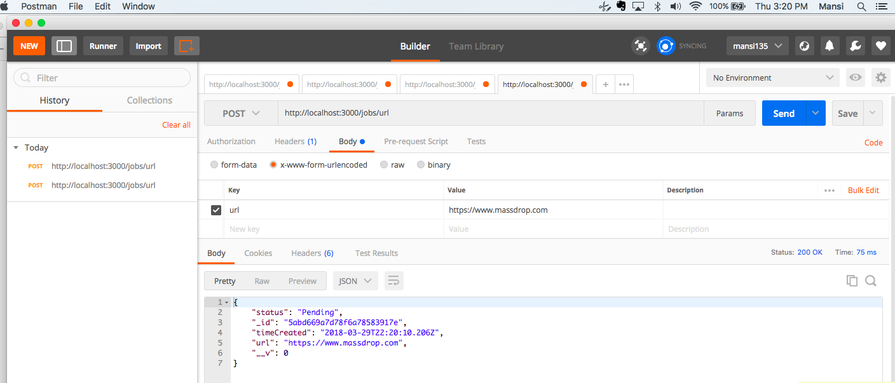
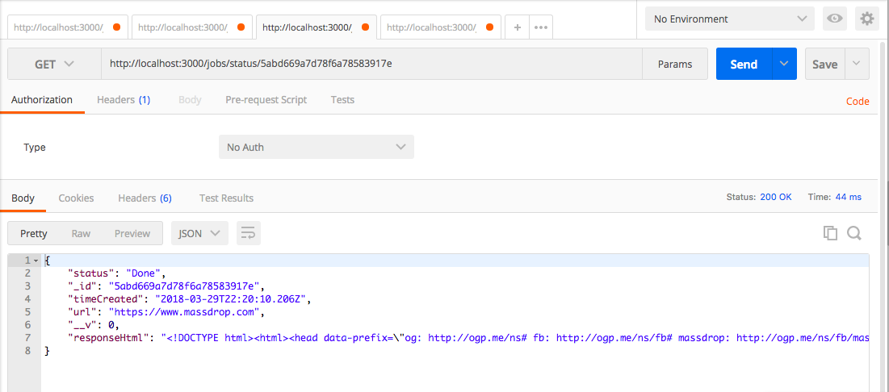

# A worker Job Queue 
Create a job queue whose workers fetch data from a URL and store the results in a database. The job queue should expose a REST API for adding jobs and checking their status / results.

Example:

User submits www.google.com to your endpoint. The user gets back a job id. Your system fetches www.google.com (the result of which would be HTML) and stores the result. The user asks for the status of the job id and if the job is complete, he gets a response that includes the HTML for www.google.com.

## Table of Contents
* [Setup](#setup)
* [Technologies Used](#technologiesused)
* [Testing](#testing)
* [Documentation and Usage](#docs)


## <a name="setup"></a>Setup

* requires npm install and mongodb installed prior to running this app
* run mongod in some terminal
* clone this directory 
* cd into cloned directory
* run node server.js

## <a name="technologiesused"></a>Tech Stack

* Database : MongoDB, Mongoose ODM
* Server : Node.js, Express.js, bluebird Promises
* Testing : Mocha

## <a name="testing"></a>Testing Framework

## <a name="docs"></a>Documentation

 I used POSTMAN to verify my GET and POST requests

* POST REQUEST - http://localhost:3000/jobs/url

 This will create a new jobEntry in the database and returns the following response-

 


* GET REQUEST - http://localhost:3000/jobs/status/:jobID

 This will get the status of jobID- 




* If there was an error in fetching url, user gets the following response-
```
     {
        "status": "Error",
        "_id": "5abd5ba46aee19a57bfb4886",
        "timeCreated": "2018-03-29T21:33:24.279Z",
        "url": "https://www.twitr.com",
        "__v": 0
    }
```

* If incorrect jobID is provided, user gets the following response-
```
    No job found
```

 
